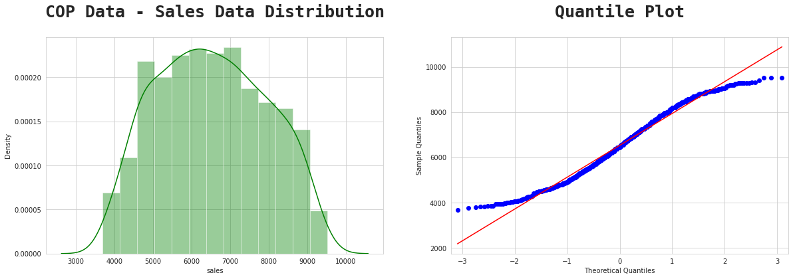
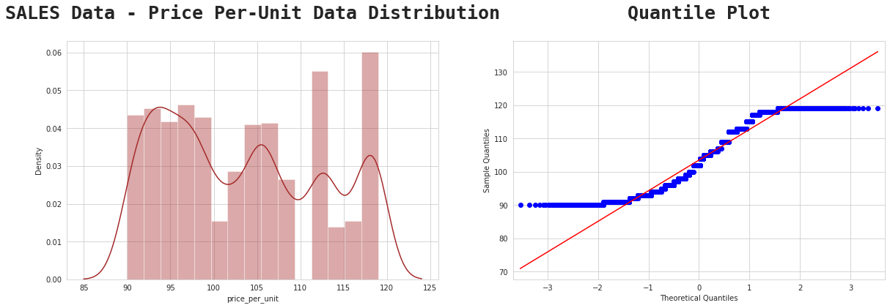

# Analysis_of_Shopping_Cart_Data

## **Index :currency_exchange:**

- [**Introduction**](#introduction)
- [**Installation**](#installation)
- [**Execution**](#execution)
- [**Dataset Composition**](#dataset-composition)
- [**Data Analysis and Visualization (EDA)**](#data-analysis-and-visualization-eda)
  - [**Univariate Data Analysis**](#univariate-data-analysis)
    - [**Sales**](#sales)
    - [**Age**](#age)
    - [**Price**](#price)
    - [**Quantity**](#quantity)
  - [**Price per-unit**](#price-per-unit)
  - [**Total price**](#total-price)
  - [**Quantity2**](#quantity2)
- [**Result**](#result)
  - [**Which products were sold the most in the last month?**](#which-products-were-sold-the-most-in-the-last-month)
  - [**Understanding Customer demographics and their preferences**](#understanding-customer-demographics-and-their-preferences)
  - [**State with highest number of Sales**](#state-with-highest-number-of-sales)
  - [**Top 20 city with high number of sales**](#top-20-city-with-high-number-of-sales)

## **Introduction :australia:**

This project seeks to apply Data Analysis skills to a shopping cart dataset of Australian State.

 

 

## **Installation**

To install the project, it is advisable to use a virtual enviroment, installing all dependencies in the **requirementes.txt**

 

## **Execution**

To execute, simply run the project **main** with the command:

`python3 main.py`

 

 

## **Dataset Composition :restroom:**

Summary of the data set so far. These are some points we have:

- Customer Order and product data:

  - We have a total of 1000 rows and 22 columns
  - There are no missing values
  - customer_name: 1000 uniqueness variable(s)
  - gender : 8 uniqueness variable(s)
  - home_address : 1000 variable(s) of uniqueness
  - city : 961 variable(s) of uniqueness
  - state : 8 uniqueness variable(s)
  - country : 1 uniqueness variable(s)
  - order_date : 291 uniqueness variable(s)
  - delivery_date : 305 uniqueness variable(s)
  - product_type : 3 uniqueness variable(s)
  - product_name : 28 variable(s) of uniqueness
  - size : 5 uniqueness variable(s)
  - color : 7 uniqueness variable(s)
  - description : 1000 variable(s) of uniqueness

- Sales data:
  - There are no missing values
  - There are no uniqueness values

All data types in this data are Int 64
Next, we will try to do some explorations and visualizations.

 

 

## **Data Analysis and Visualization (EDA) :atm:**

By printing the data it's possible see the correlation value is between -1 and 1. The closer the values are to 1 or -1, the greater the correlation. Exactly 1 or -1 represents perfect correlation. 0 represents no correlation.

**Note:** NaN is expected if the values do not vary. To understand why, take a look at the correlation formula:

 

$$
cor(i,j) = \frac{cov(i,j)}{[stedev(i)stdev(j)]}
$$

 

If the values of variables i or j do not vary, the respective standard deviation will be zero and so will the denominator of the fraction. Therefore, the correlation will be NaN.

 

 

We can see that some features appear to be highly correlated with each other.

**For instance:**

- Sales and Price are highly correlated meaning one affects the other.
- If the price is high, sales will go down and vice-versa.

 

 

### **Univariate Data Analysis**

#### Sales

Find the proportion that lies in between two standard deviation ( $𝜎$ ) from mean ( $𝜇$ ), and interprete that.

In the Sales Data, the $𝜇$=6533 and the $𝜎$=1409. You can calculate that using pandas mean() function on the sales data.

 

**Calculation:**

- 6533−2(1409)=3715

- 6533+2(1409)=9531

i.e the mean minus 2 standard deviation and the mean plus 2 standard deviation.

 

**Interpretation:**

At least 75% of the Shopping Cart Database Sales customer population in Australia has sales ranging from 3715−9531 (Australian Dollars).

#### Age

Find the proportion that lies in between two standard deviation ( $𝜎$ ) from mean ( $𝜇$ ), and interprete that. In the Age Data, the $𝜇$=49.8 and the $𝜎$=17.6.

 

**Calculation:**

- 49.8−2(17.6)=14.59

- 49.8+2(17.6)=85.0

 

**Interpretation:**

At least 75% of the Shopping Cart Database customer population in Australia has an age range of 14−85 years.

#### Price

Find the proportion that lies in between two standard deviation ( $𝜎$ ) from mean ( $𝜇$ ), and interprete that. In the Price Data, the $𝜇$=108.095 and the $𝜎$=9.15.

 

**Calculation:**

- 108.095−2(9.15)=89.795

- 108.095+2(9.15)=126.395

 

**Interpretation:**

At least 75% of Shopping Cart population in the product price database in Australia has a price range from 89,795−126,395 (Australian Dollars).

#### Quantity

Find the proportion that lies in between two standard deviation ( $𝜎$ ) from mean ( $𝜇$ ), and interprete that. In the Quantity Data, the $𝜇$=60.3 and the $𝜎$=11.6

 

**Calculation:**

- 60.3−2(11.6)=37

- 60.3+2(11.6)=83.5

 

**Interpretation:**

At least 75% of the Shopping Cart Database Quantity ordered population in Australia has a quantity range from 37−83.5 quantity ordered.

#### Price Per-Unit

Find the proportion that lies in between two standard deviation ( $𝜎$ ) from mean ( $𝜇$ ), and interprete that. In the Price Per Unit Data, the $𝜇$=103.5 and the $𝜎$=9.1

**Calculation:**

 

103.5−2(9.1)=85.3

103.5+2(9.1)=121.7

 

**Interpretation:**

At least 75% of the population of the Shopping Cart Database, the per unit price range is in between 85.3 to 121.7 (Australian Dollars).

#### Total Price

Find the proportion that lies in between two standard deviation ( $𝜎$ ) from mean ( $𝜇$ ), and interprete that. In the Total Price Data, the $𝜇$=206.3 and the $𝜎$=86.3

**Calculation:**

 

206.3−2(86.3)=33.7

206.3+2(86.3)=378.9

 

**Interpretation:**

At least 75% of the sales data has a total price range from 33.7 to 378.9 (Australian Dollars).

#### Quantity2

Find the proportion that lies in between two standard deviation ( $𝜎$ ) from mean ( $𝜇$ ), and interprete that. and In the Quantity Data, the $𝜇$=2 and the $𝜎$=1 , if we round it.

**Calculation:**

 

2−2(1)=0

2+2(1)=4

 

**Interpretation:**

At least 75% of the population of Shopping Cart Database Quantity ordered in Australia has a total quantity range from 0−4 quantity ordered.

 

 

## **Result :diamond_shape_with_a_dot_inside**

### **Which products were sold the most in the last month?**

 

## **Understanding Customer demographics and their preferences :rainbow_flag:**

 

[Read more about the different types of gender here](https://teentalk.ca/learn-about/gender-identity/#:~:text=There%20are%20many%20different%20gender,identities%20then%20we've%20listed.)

 

 

Quite suprising how male managed to shop more than females...lol

 

### **State with highest number of Sales :heavy_dollar_sign:**

 

**South Australia** took first place with the highest total sales of 907.400 (Dollar Australia), and Queensland took second place with sales of 862.965 (Dollar Australia).

 

### **Top 20 city with high number of sales :heavy_check_mark:**

 

**East Aidan** occupies the first position in the city with the highest number of sales with total sales of 20.247 (Dollar Australia), and the second position is occupied by East Sophia with total sales of 19.628 (Dollar Australia).

_Enjoy 2F_
